# TLAdmin

TLAdmin 是一个前后端分离的中后台管理框架，用来快速搭建后台系统的基础盘：登录、权限、菜单、配置、日志、上传、接口文档、第三方能力配置和常用工具都已经内置。

它解决的核心问题不是“生成几个 CRUD 页面”，而是把每个后台项目都会反复踩的基础问题先处理好，让后续业务模块直接往上接。

## 解决的痛点

### 1. 每个后台都要重复搭基础架子

普通后台项目一开始就要做登录、token、管理员、角色、菜单、按钮权限、部门、岗位、字典、系统配置、操作日志、登录日志。  
TLAdmin 已经把这些基础模块放进后端，业务项目可以直接在这个权限和配置体系上开发。

### 2. 权限容易前后端不一致

很多项目只在前端隐藏按钮，但后端接口没有真正拦住，或者菜单、按钮、接口权限分散维护。  
TLAdmin 把菜单、按钮、接口权限统一成一套 RBAC 模型，前端根据后端菜单树生成路由，后端根据接口权限做最终校验。

### 3. 接口文档经常和真实代码脱节

手写接口文档很容易过期，调试时还要单独找 token、拼参数。  
TLAdmin 使用控制器注解和响应 VO 生成 OpenAPI 文档，接口、权限、返回结构来自同一份代码，并内置 Swagger UI 调试台。

### 4. API 返回格式和错误处理不统一

不同接口各写各的返回结构，前端请求层就会越来越乱。  
TLAdmin 后端统一返回 `code/message/data/request_id/timestamp`，并支持 JSON/XML 双格式；前端统一处理 token、刷新 token、401、403、错误提示、上传和下载。

### 5. 上传和对象存储接入成本高

文件上传如果都走后端，会占服务器带宽；直接接 OSS/COS/七牛又会把密钥和 SDK 逻辑散落到业务里。  
TLAdmin 采用后端签发上传凭证、前端直传云端的方式，本地磁盘作为兜底，并统一登记附件记录。

### 6. 第三方能力配置容易混乱

支付、公众号、短信、OSS 如果直接在业务代码里调用 SDK，后面换渠道、查问题、保护密钥都会很麻烦。  
TLAdmin 把支付、微信公众号、短信、存储统一放到 Service 和配置 schema 里，密钥加密存储，接口返回脱敏。

### 7. 排查问题缺少链路

后台系统出问题时，如果没有 request_id、登录日志、操作日志，很难定位是谁、什么时候、请求了什么。  
TLAdmin 每次请求带 `request_id`，并提供登录日志、操作日志和敏感字段脱敏。

### 8. 常用工具到处重复写

日期、金额、字符串、数组、随机数、UUID、HTTP 请求、文件、拼音这些工具如果每个模块临时写，会导致行为不一致。  
TLAdmin 后端和前端都提供了统一工具库，业务代码可以直接复用。

## 当前已经具备

### 后端

- **认证**：登录、退出、刷新 token、修改密码、当前用户信息；access + refresh token 存 Redis；登录失败锁定。
- **动态验证码**：Google Authenticator（TOTP）二次验证，全局开关 + 个人绑定/解绑。
- **RBAC 权限**：管理员、角色、菜单（目录/菜单/按钮/接口四类节点），按钮与接口权限统一校验，超管绕过。
- **数据权限**：角色 `data_scope`（全部/本部门及以下/本部门/自定义部门/仅本人）自动过滤列表数据。
- **系统模块**：部门（树）、岗位、字典（类型 + 数据）、系统配置。
- **会员体系**：C 端会员（`tl_user`）后台管理 + C 端便捷函数（注册、登录、取信息、改手机号、改密码，独立 token，见手册）。
- **日志（MongoDB）**：操作日志、登录日志、第三方请求日志，敏感字段脱敏，支持 request_id 检索。
- **安全**：接口限流（按用户/IP 每秒计数）、IP 归属地屏蔽（国家/省/市/区县级联选择）。
- **附件**：前端直传 OSS/COS/七牛 + 本地磁盘兜底 + 一次性上传票据 + 私有桶临时访问 URL。
- **第三方能力**：支付、微信公众号、短信、存储统一 Service + 配置 schema，密钥加密存储、返回脱敏，后台可视化配置。
- **任务**：定时任务（cron 表达式 + Redis 同分钟去重）、Redis 队列（即时/延迟、自动重试、失败日志）。
- **代码生成器**：从数据表 + 字段配置生成后端 VO/Service/Controller + 前端页面 + 菜单种子，支持生成前代码预览（CLI 与后台可视化两种入口）。
- **OpenAPI**：控制器注解自动生成文档 + Swagger UI 调试台，接口/权限/返回结构来自同一份代码。
- **工具库**：统一 HTTP 客户端、日期、金额、字符串、数组、加密、文件、拼音、二维码、邮件、敏感词、五级行政区划、手机号/IP 归属地等（见工具手册）。
- **CLI**：迁移、种子、路由、定时调度、队列、代码生成。

### 前端（Vue3 + TDesign）

- 登录页（TDesign 官方风格，支持动态验证码）、按后端菜单树生成的动态路由、`v-permission` 按钮权限指令。
- 后台布局：左侧菜单、顶部栏、面包屑、多标签页、全屏、个人中心、退出登录。
- 系统管理页：管理员、角色、菜单、部门、岗位、字典、系统配置、操作/登录/第三方日志、附件、插件配置。
- 会员管理、代码生成器（可视化字段配置 + 代码预览）、个人中心（改密码 / TOTP 绑定）。
- 通用组件：`TablePlus`（分页表格）、`FormDialog`（弹窗表单）、`UploadPlus`（直传）、`v-permission`（按钮权限）。
- 统一请求封装：自动带 token、401 刷新 token 重放、403 提示、统一错误提示、上传、blob 下载。
- 工具库：`request`、`date`、`string`、`array`、`money`、`file`、`random`、`uuid`、`token`。
- 全局时间格式：后台可配置，前端所有时间统一按该格式渲染。

## 界面预览

### 登录

账号密码登录，账号开启动态验证码后自动要求输入 6 位验证码。

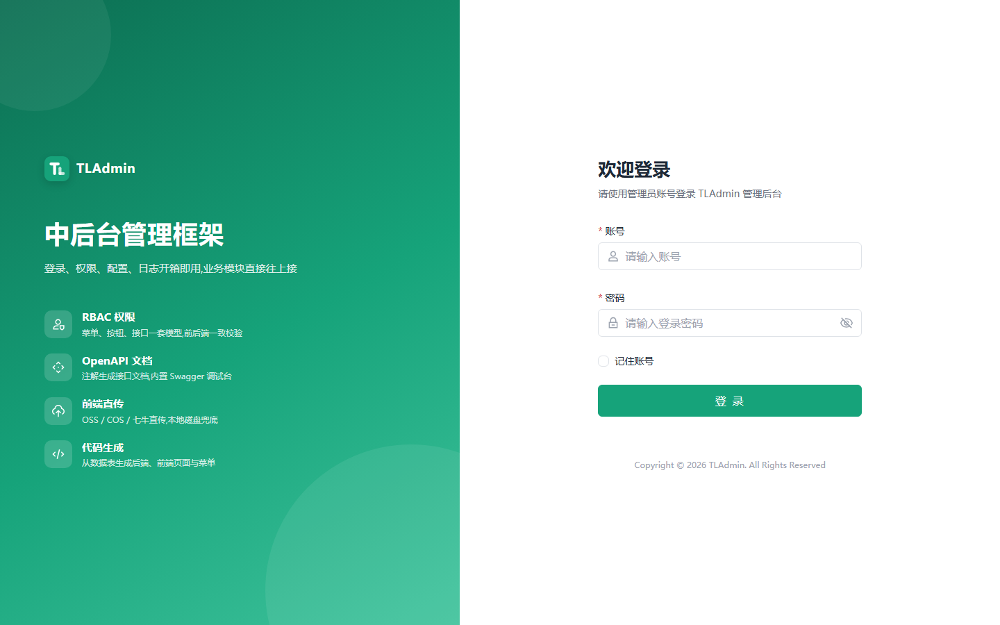

### 仪表盘

管理员、角色、会员、今日登录统计，近 7 天操作量和最近登录；每块按当前账号的查看权限显示，没有权限的不出现。

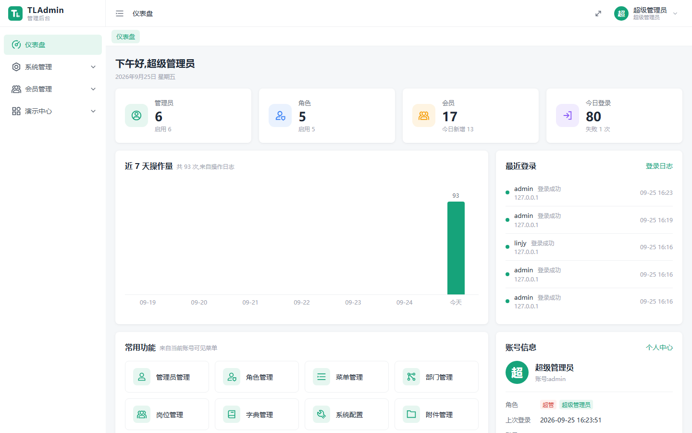

### 演示中心 · 工具箱

内置 Tools 工具库在线试用：万年历、拼音、敏感词、手机号/IP 归属地、五级行政区划、金额大写、二维码。

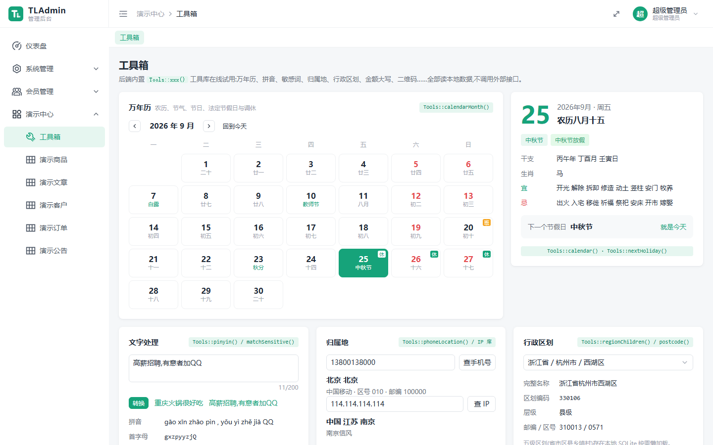

### 演示中心 · 生成的页面

由代码生成器生成、未手改的 CRUD 页面，含模糊/精确搜索、开关、日期时间字段。

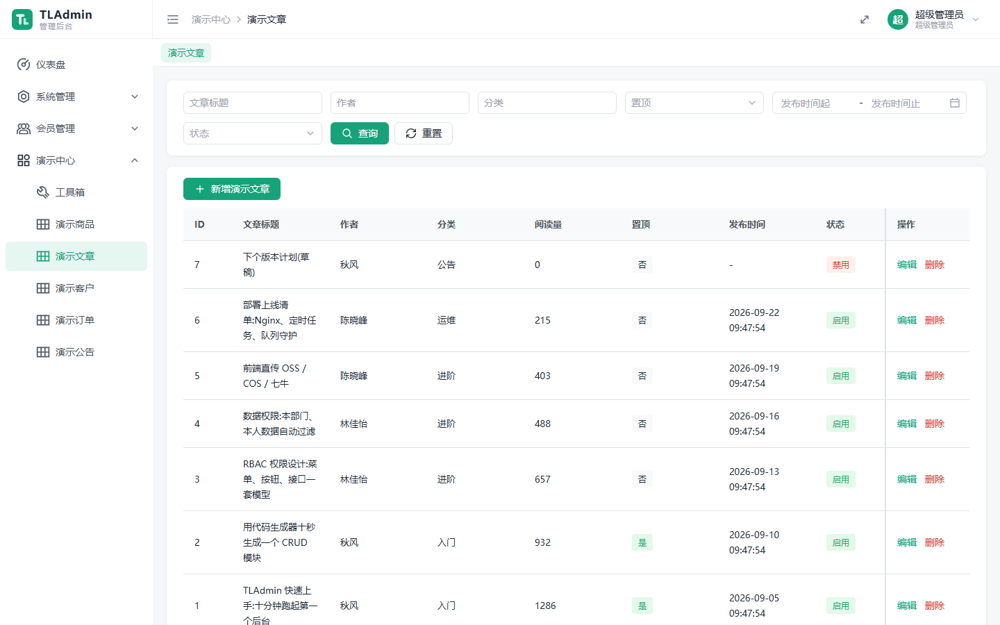

### 管理员管理

分配角色、部门、岗位，支持重置密码和重置动态验证码。

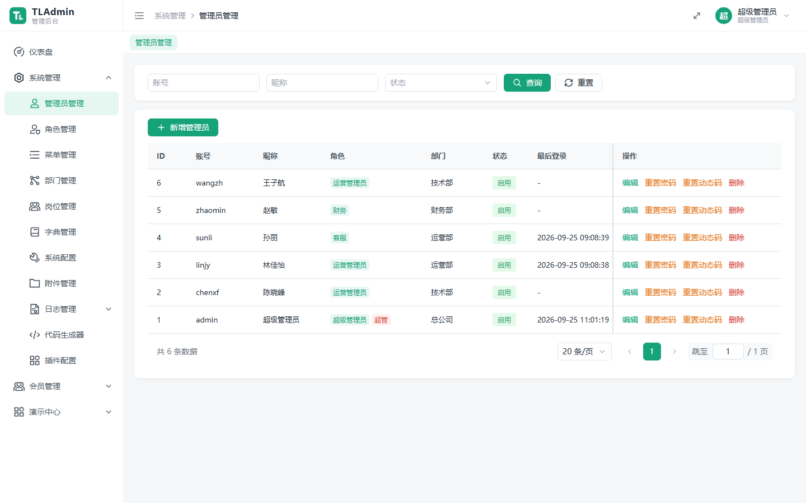

### 新增管理员

统一的弹窗表单组件 FormDialog。

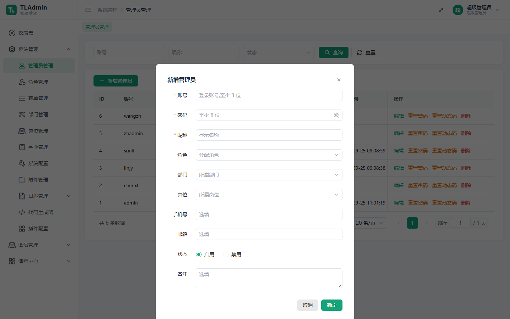

### 角色管理

角色绑定菜单权限，并配置数据权限范围（全部 / 本部门及以下 / 本部门 / 仅本人）。

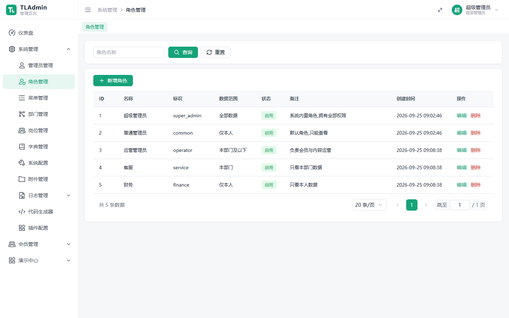

### 菜单管理

目录、菜单、按钮、接口四类节点，前端路由和后端接口权限共用一套标识。

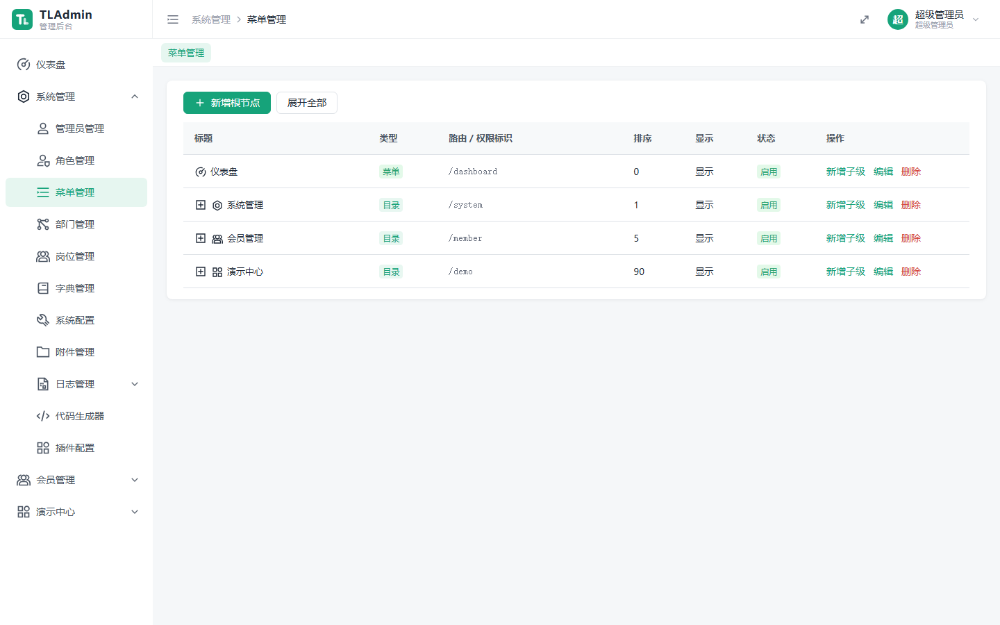

### 插件配置

支付、公众号、小程序、短信、存储统一配置；短信和存储选哪家服务商就只显示哪家的密钥项，密钥加密存储。

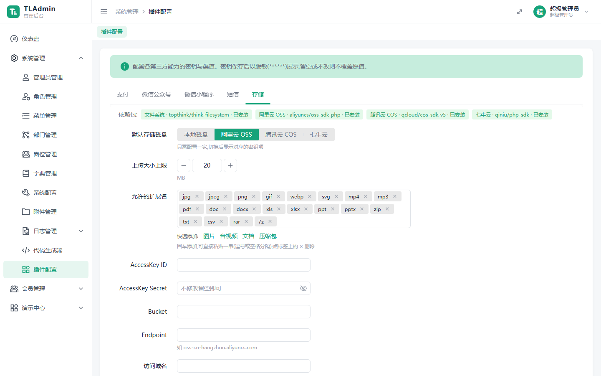

### 代码生成器

选择数据表，逐字段配置列表、搜索、表单控件，预览后生成后端、前端和菜单。

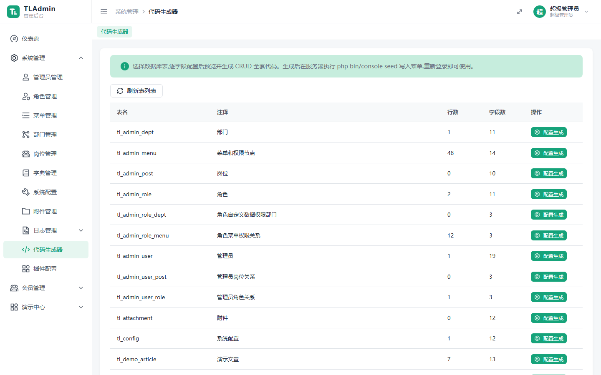

### 操作日志

每次请求带 request_id，日志写入 MongoDB，敏感字段自动脱敏。

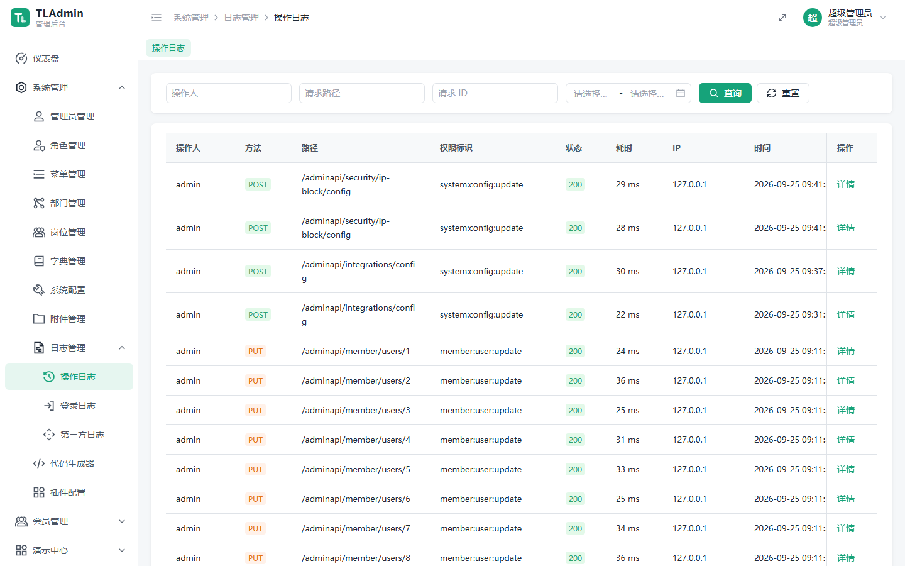

### 会员管理

C 端会员后台管理，与后台管理员账号体系分离。

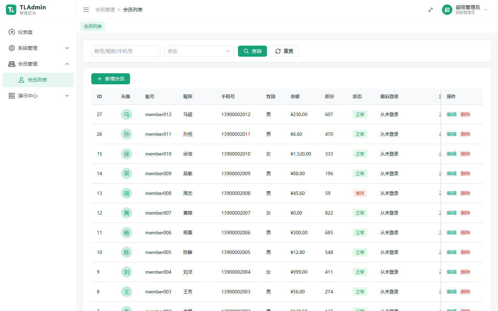

## 技术栈

| 部分 | 技术 | 说明 |
|---|---|---|
| 服务端 | PHP 8.2+ | 运行环境；行政区划需 pdo_sqlite 扩展，二维码需 gd 扩展 |
|  | ThinkPHP 8 | 框架底座；控制器方法上的注解同时生成路由、权限和 OpenAPI 文档 |
|  | think-orm | 数据库访问；迁移和种子统一放在 database/migrations、database/seeders |
| 数据 | MySQL 8 | 业务数据：管理员、角色、菜单、配置、会员等 |
|  | Redis | access / refresh token、登录失败计数、接口限流计数、队列 |
|  | MongoDB | 操作日志、登录日志、第三方请求日志，按 request_id 检索 |
| 后台前端 | Vue 3 + TypeScript | 按后端菜单树生成动态路由，v-permission 控制按钮权限 |
|  | Vite | 开发代理到后端，构建产物可直接部署到 server/public/admin |
|  | TDesign Vue Next | 组件库；通用组件 TablePlus、FormDialog、UploadPlus 基于它封装 |
|  | Pinia | 登录态、用户信息、菜单树、权限集合 |
|  | Vue Router | 动态路由和登录守卫 |
|  | Axios | 统一请求层：自动带 token，401 自动刷新 token 后重放，统一错误提示 |
| 认证 | access + refresh token | token 存 Redis，登录失败自动锁定 |
|  | pragmarx/google2fa | Google Authenticator 动态验证码，可全局开启 |
| 第三方 | yansongda/pay | 微信支付、支付宝；密钥加密存库，接口返回脱敏 |
|  | EasyWeChat | 公众号配置，小程序登录与手机号一键授权 |
|  | EasySms | 短信：阿里云、腾讯云，后台选哪家就用哪家 |
|  | 阿里云 OSS SDK | 前端直传阿里云 OSS |
|  | 腾讯云 COS SDK | 前端直传腾讯云 COS |
|  | 七牛 SDK | 前端直传七牛云；都不配时落到本地磁盘 |
| 工具库 | overtrue/pinyin | 拼音、首字母、URL 别名 |
|  | overtrue/php-opencc | 简繁转换 |
|  | 6tail/lunar-php | 万年历：农历、节气、节日、法定节假日与调休 |
|  | bacon/bacon-qr-code | 二维码 |
|  | Carbon | 日期处理 |
|  | Guzzle | 统一 HTTP 客户端 |
|  | 本地数据文件 | 手机号 / IP 归属地、五级行政区划、敏感词库，不调用外部接口 |
| 接口文档 | zircote/swagger-php | 从注解和响应 VO 生成 OpenAPI |
|  | Swagger UI | 内置调试台，可设访问密码 |

## 项目结构

```text
TLAdmin/
  server/                       后端
    app/
      adminapi/controller/      控制器(注解路由,后台 /adminapi 与 C 端 /api 均在此扫描)
      adminapi/vo/              响应 VO(ApiField 注解 → OpenAPI schema)
      adminapi/middleware/      认证、限流、权限中间件
      common/service/           业务 Service(auth/system/member/log/integration/geo/security)
      common/support/           工具库统一入口 Tools::xxx()
      common/queue/             Redis 队列(Queue::push + queue:work)
      common/schedule/          定时调度(cron 解析 + schedule:run)
      common/generator/         代码生成器
      job/                      队列任务与定时任务实现
    database/migrations|seeders 迁移与种子
    bin/console                 CLI 入口
  web/                          前端管理后台
    src/api/                    接口请求(system/member/gen)
    src/components/             通用组件(TablePlus/FormDialog/UploadPlus)
    src/pages/                  页面
    src/utils/                  前端工具库
  docs/                         文档(见下方「文档」)
```

## 文档

| 文档 | 内容 |
|------|------|
| `docs/tladmin-helper-manual.md` | 工具类、服务层便捷函数、前端工具库与组件的使用手册（带签名和实测示例） |
| `docs/tladmin-deploy.md` | 部署文档（Nginx、crontab、队列守护、上线清单） |
| `docs/tladmin-thinkphp8-admin-design.md` | 设计文档（需求权威） |
| `server/README.md` | 后端说明与接口清单 |
| `web/README.md` | 前端说明 |

## 本地启动

后端：

```bash
cd server
composer install
cp .env.example .env
php bin/console migrate
php bin/console seed
php -S 127.0.0.1:8000 -t public public/router.php
```

默认账号：

```text
admin / admin123456
```

前端：

```bash
cd web
npm install
npm run dev
```

访问地址：

```text
前端：http://127.0.0.1:5173
后端：http://127.0.0.1:8000
接口调试台：http://127.0.0.1:8000/api-docs.html
```

## 两套 API

- **后台 API `/adminapi/*`**：管理后台用，走 access token + RBAC 权限校验。
- **C 端 API `/api/*`**：小程序/App/H5 用，独立的会员 token（与后台隔离），不走后台 RBAC。例如会员注册、登录、个人资料等。

## 常用命令

```bash
cd server
php bin/console migrate          # 执行未应用的迁移
php bin/console migrate:status   # 迁移状态
php bin/console seed             # 初始化/补充种子数据
php bin/console route:list       # 查看全部注解路由与权限
php bin/console route:cache      # 重建路由缓存
php bin/console schedule:list    # 查看定时任务表
php bin/console schedule:run     # 执行到期定时任务(配合系统 crontab 每分钟调用)
php bin/console queue:work       # 队列消费(--once 只消费一条)
php bin/console queue:size       # 查看队列积压
php bin/console gen:crud 表名 --title=名称   # 生成 CRUD 全套代码
php tests/run.php                # 运行测试(需要数据库的用例在库不可用时跳过;有失败时退出码为 1)
php tests/run.php Generator      # 只运行文件名包含 Generator 的测试

cd web
npm run dev                      # 开发
npm run build                    # 类型检查 + 生产构建
```

# 部署文档

> 适用版本:server(PHP 8.2+)+ web(Node 20+ 构建)。Author: qiufeng

## 1. 环境要求

| 组件 | 版本 | 用途 |
|------|------|------|
| PHP | >= 8.2(扩展:pdo_mysql、redis、mongodb、curl、openssl、mbstring) | 后端运行时 |
| MySQL | >= 8.0 | 业务数据 |
| Redis | >= 6 | token / 限流 / 队列 / 上传票据 |
| MongoDB | >= 6 | 操作 / 登录 / 第三方请求日志 |
| Node.js | >= 20 | 前端构建(仅构建机需要) |
| Nginx | >= 1.20 | 反向代理与静态资源 |

## 2. 后端部署

```bash
cd server
composer install --no-dev --optimize-autoloader

# 配置环境
cp .env.example .env
# 修改 .env:数据库、Redis、MongoDB、APP_KEY(生产必须改成随机串)

# 初始化数据库
php bin/console migrate
php bin/console seed          # 默认账号 admin / admin123456,部署后立即改密

# 预热路由缓存(可选,首个请求也会自动生成)
php bin/console route:cache
```

PHP-FPM 站点根目录指向 `server/public`,所有请求重写到 `index.php`。

## 3. 前端部署

```bash
cd web
npm ci
npm run build                 # 产物在 web/dist/
```

把 `dist/` 部署到 Nginx 静态目录(如 `/var/www/tladmin-admin`),
或复制到 `server/public/admin/`。

## 4. Nginx 配置示例

```nginx
server {
    listen 80;
    server_name admin.example.com;

    # 前端 SPA
    root /var/www/tladmin-admin;
    index index.html;
    location / {
        try_files $uri $uri/ /index.html;   # history 路由回退
    }

    # 后端 API
    location /adminapi {
        include fastcgi_params;
        fastcgi_pass unix:/run/php/php8.2-fpm.sock;
        fastcgi_param SCRIPT_FILENAME /var/www/tladmin/server/public/index.php;
    }

    # 本地磁盘附件(使用云存储直传时可去掉)
    location /storage {
        alias /var/www/tladmin/server/public/storage;
    }
}
```

> 部署在反向代理后,记得在「系统配置 → IP 归属地屏蔽」开启"信任代理头",
> 否则客户端 IP 取到的是代理地址。

## 5. 定时任务与队列

```bash
# 系统 crontab(每分钟调度一次,到期任务才会执行,Redis 锁防止多机重复)
* * * * * cd /var/www/tladmin/server && php bin/console schedule:run >> runtime/log/schedule.log 2>&1

# 队列常驻进程(用 systemd / supervisor 守护)
php bin/console queue:work
```

systemd 单元示例(`/etc/systemd/system/tladmin-queue.service`):

```ini
[Unit]
Description=TLAdmin Queue Worker
After=redis.service

[Service]
WorkingDirectory=/var/www/tladmin/server
ExecStart=/usr/bin/php bin/console queue:work
Restart=always
User=www-data

[Install]
WantedBy=multi-user.target
```

## 6. 上线检查清单

- [ ] `.env` 的 `APP_KEY` 已换成随机串(影响云存储密钥加密)
- [ ] admin 默认密码已修改;按需开启动态验证码全局开关
- [ ] MySQL / Redis / MongoDB 不对公网暴露
- [ ] 附件存储:云存储直传需在「附件管理 → 第三方配置」填入密钥(自动加密存储)
- [ ] OpenAPI 文档地址 `/api-docs.html` 视情况限制访问
- [ ] crontab 与队列进程已配置并验证(`php bin/console queue:size`)
- [ ] 日志保留策略默认 90 天(`config/schedule.php` 可调)

## 7. 常用运维命令

```bash
php bin/console migrate:status    # 迁移状态
php bin/console route:list        # 全部路由与权限标识
php bin/console schedule:list     # 定时任务表
php bin/console queue:size        # 队列积压
php bin/console gen:crud tl_xxx --title=业务名   # 生成 CRUD 全套代码
```


# 使用手册

本文档是 TLAdmin 的完整使用手册。它不是工具类列表，也不是设计说明，而是给开发者查“怎么用、去哪改、有哪些能力、对应文档在哪里”的操作手册。

阅读规则：

- TLAdmin 自有能力在本文写明入口、流程、接口、权限、文件位置和二次开发点。
- 第三方插件只列功能标题、常用类/函数标题和跳转，不复制 vendor 文档正文。
- `server/vendor` 是依赖源码目录，业务开发不要改 vendor；需要二次封装时写到 `server/app/common/service` 或 `server/app/common/support`。

## 目录

- [1. 快速启动](#1-快速启动)
- [2. 新增业务模块标准流程](#2-新增业务模块标准流程)
- [3. 后端框架手册](#3-后端框架手册)
- [4. 内置业务能力手册](#4-内置业务能力手册)
- [5. 用户体系和扩展能力](#5-用户体系和扩展能力)
- [6. 前端框架手册](#6-前端框架手册)
- [7. 内置 Tools 手册](#7-内置-tools-手册)
- [8. CLI 命令手册](#8-cli-命令手册)
- [9. server/vendor 插件手册索引](#9-servervendor-插件手册索引)
- [10. 开发约定](#10-开发约定)

## 1. 快速启动

### 1.1 后端启动

```bash
cd server
composer install
cp .env.example .env
php bin/console migrate
php bin/console seed
php -S 127.0.0.1:8000 -t public public/router.php
```

默认管理账号：

```text
admin / admin123456
```

### 1.2 前端启动

```bash
cd web
npm install
npm run dev
```

访问入口：

```text
前端：http://127.0.0.1:5173
后端：http://127.0.0.1:8000
Swagger UI：http://127.0.0.1:8000/api-docs.html
OpenAPI JSON：http://127.0.0.1:8000/adminapi/openapi.json
```

### 1.3 本地环境配置

后端配置文件：`server/.env`

| 配置 | 用途 |
| --- | --- |
| `APP_NAME` | 应用名称 |
| `APP_ENV` | 环境名，开发环境一般为 `local` |
| `APP_DEBUG` | 是否开启 debug |
| `APP_KEY` | 加密密钥，生产环境必须设置 |
| `API_RESPONSE_FORMAT` | 默认 API 响应格式，`json` 或 `xml` |
| `DB_*` | MySQL 连接 |
| `REDIS_*` | Redis 连接，token、队列、限流依赖它 |
| `MONGO_*` | MongoDB 连接，登录日志和操作日志可写入这里 |

### 1.4 首次验收

启动后按以下顺序验收：

1. `php bin/console migrate:status` 确认迁移已执行。
2. `php bin/console route:list` 能输出路由表。
3. 浏览器打开 `http://127.0.0.1:8000/adminapi/health?format=json`。
4. 浏览器打开 `http://127.0.0.1:8000/adminapi/health?format=xml`。
5. 前端登录 `admin / admin123456`。
6. 打开 Swagger UI，登录后把 access token 填到 Authorize。

## 2. 新增业务模块标准流程

以下流程适用于新增后台业务模块，例如文章、商品、订单、客户等。

### 2.1 数据库

1. 新增迁移文件到 `server/database/migrations`。
2. 表名使用 `tl_` 前缀。
3. 建议字段：

```text
id
status
sort
remark
create_time
update_time
delete_time
created_by
updated_by
dept_id
```

4. 初始化菜单、权限、字典写到 `server/database/seeders`。
5. 执行：

```bash
cd server
php bin/console migrate
php bin/console seed
```

### 2.2 后端文件

| 类型 | 放置位置 | 说明 |
| --- | --- | --- |
| Controller | `server/app/adminapi/controller` | 接口入口，只取参数、调 Service、返回 VO |
| Service | `server/app/common/service` | 业务逻辑、事务、数据校验 |
| VO | `server/app/adminapi/vo` | 响应结构，给 OpenAPI 使用 |
| Migration | `server/database/migrations` | 表结构 |
| Seeder | `server/database/seeders` | 初始菜单、权限、字典 |

### 2.3 前端文件

| 类型 | 放置位置 | 说明 |
| --- | --- | --- |
| API | `web/src/api` | 请求函数和类型 |
| 前端页面 | `web/src/pages` | 菜单 component 对应的 Vue 页面 |
| 通用组件 | `web/src/components` | 可复用表格、弹窗、上传 |

菜单表中的 `component` 字段与页面路径对应：

```text
system/user/index      -> 对应 pages 下的系统用户页面
gen/demo-product/index -> 对应 pages 下的演示商品页面
```

### 2.4 权限

权限命名建议：

```text
模块:资源:动作
system:user:list
system:user:create
system:user:update
system:user:delete
order:refund:create
```

菜单节点类型：

| type | 用途 |
| --- | --- |
| `catalog` | 菜单目录 |
| `menu` | 页面菜单 |
| `button` | 按钮权限 |
| `api` | 接口权限 |

接口权限写在 Mapping 注解：

```php
#[GetMapping(permission: 'system:user:list', summary: '管理员列表', listOf: AdminUserVo::class)]
```

按钮权限写在前端：

```vue
<t-button v-permission="'system:user:create'">新增</t-button>
```

### 2.5 OpenAPI

1. VO 属性使用 `#[ApiField]` 写说明。
2. 分页接口返回 `PageVo`，Mapping 写 `listOf`。
3. 数组或特殊结构用 `response` 手动声明。
4. 原始响应用 `raw: true`。

生成后打开：

```text
http://127.0.0.1:8000/api-docs.html
```

## 3. 后端框架手册

### 3.1 Controller 手册

控制器基类：[BaseController.php](server/app/adminapi/controller/BaseController.php)

| 方法 | 参数 | 返回 | 用途 |
| --- | --- | --- | --- |
| `input` | `string $key, mixed $default = null` | `mixed` | 读取 JSON/form，请求体没有时回退 query |
| `query` | `string $key, mixed $default = null` | `mixed` | 读取 URL 查询参数 |
| `param` | `string $key, mixed $default = null` | `mixed` | 读取路径参数 |
| `authUserId` | 无 | `int` | 当前登录管理员 ID |
| `success` | `mixed $data, string $message` | `Response` | 手动成功响应 |
| `fail` | code/message/data/status | `Response` | 手动失败响应 |

控制器写法：

```php
#[RestController('/adminapi/system/posts', tag: '岗位')]
final class PostController extends BaseController
{
    #[GetMapping(permission: 'system:post:list', summary: '岗位列表', listOf: PostVo::class)]
    public function index(): PageVo
    {
        return PageVo::of(
            $this->service->paginate(
                ['name' => (string) $this->query('name', '')],
                max(1, (int) $this->query('page', 1)),
                min(100, max(1, (int) $this->query('page_size', 20)))
            ),
            PostVo::class
        );
    }
}
```

注意：

- Controller 不写复杂业务。
- 写操作必须在 Service 中做参数校验和业务校验。
- 涉及多表更新时由 Service 负责事务。
- 删除操作优先软删除。

### 3.2 注解路由手册

注解文件：

| 注解 | 文件 | 说明 |
| --- | --- | --- |
| `RestController` | [RestController.php](/server/app/common/router/RestController.php) | 控制器前缀和 OpenAPI 分组 |
| `GetMapping` | [GetMapping.php](server/app/common/router/GetMapping.php) | GET |
| `PostMapping` | [PostMapping.php](server/app/common/router/PostMapping.php) | POST |
| `PutMapping` | [PutMapping.php](server/app/common/router/PutMapping.php) | PUT |
| `DeleteMapping` | [DeleteMapping.php](server/app/common/router/DeleteMapping.php) | DELETE |
| `Mapping` | [Mapping.php](server/app/common/router/Mapping.php) | 参数定义基类 |

`Mapping` 参数：

| 参数 | 类型 | 用途 |
| --- | --- | --- |
| `path` | string | 路由路径，相对路径拼接 controller prefix |
| `permission` | string | 权限标识，空表示登录即可 |
| `summary` | string | Swagger UI 标题 |
| `message` | string | 成功响应 message |
| `auth` | bool | 是否需要登录 |
| `listOf` | string/null | 列表元素 VO 或标量类型 |
| `response` | string/array/null | 手动声明响应 schema |
| `raw` | bool | 是否原始响应 |
| `tag` | string/null | OpenAPI 分组 |
| `body` | array | 请求体参数声明 |
| `query` | array | URL 查询参数声明 |

请求参数声明：

```php
#[PostMapping(
    '/login',
    summary: '登录',
    auth: false,
    body: [
        'username' => ['type' => 'string', 'description' => '账号', 'required' => true],
        'password' => ['type' => 'string', 'description' => '密码', 'required' => true],
    ]
)]
```

### 3.3 统一响应手册

普通 API 响应：

```json
{
  "code": 0,
  "message": "ok",
  "data": {},
  "request_id": "req_xxx",
  "timestamp": 1780000000
}
```

格式切换：

```text
GET /adminapi/health?format=json
GET /adminapi/health?format=xml
Accept: application/json
Accept: application/xml
```

相关文件：

| 文件 | 说明 |
| --- | --- |
| [ApiResponse.php](server/app/common/response/ApiResponse.php) | 响应数据对象 |
| [ApiResponseFactory.php](server/app/common/response/ApiResponseFactory.php) | 成功/失败响应工厂 |
| [ResponseFormatResolver.php](server/app/common/response/ResponseFormatResolver.php) | 响应格式解析 |
| [JsonResponseFormatter.php](server/app/common/response/formatter/JsonResponseFormatter.php) | JSON formatter |
| [XmlResponseFormatter.php](server/app/common/response/formatter/XmlResponseFormatter.php) | XML formatter |

错误码约定：

| code | HTTP | 含义 |
| --- | --- | --- |
| `0` | 200 | 成功 |
| `40000` | 400 | 参数错误 |
| `40100` | 401 | 未登录或 token 失效 |
| `40300` | 403 | 无权限 |
| `40400` | 404 | 资源不存在 |
| `40900` | 409 | 业务冲突 |
| `42900` | 429 | 请求过于频繁 |
| `50000` | 500 | 服务端异常 |

### 3.4 VO 和 OpenAPI 手册

VO 目录：`server/app/adminapi/vo`

核心文件：

| 文件 | 说明 |
| --- | --- |
| [ApiField.php](server/app/common/openapi/ApiField.php) | 字段注解 |
| [BaseVo.php](server/app/adminapi/vo/BaseVo.php) | VO 基类，支持 `from` 和 `list` |
| [PageVo.php](server/app/adminapi/vo/PageVo.php) | 分页响应 |
| [PaginationVo.php](server/app/adminapi/vo/PaginationVo.php) | 分页信息 |
| [OpenApiController.php](server/app/adminapi/controller/OpenApiController.php) | OpenAPI 生成 |

VO 示例：

```php
final class RoleVo extends BaseVo
{
    #[ApiField('角色 ID')]
    public int $id;

    #[ApiField('角色名称')]
    public string $name;

    #[ApiField('角色编码')]
    public string $code;
}
```

分页示例：

```php
#[GetMapping(permission: 'system:role:list', summary: '角色列表', listOf: RoleVo::class)]
public function index(): PageVo
{
    return PageVo::of($this->service->paginate($filters, $page, $pageSize), RoleVo::class);
}
```

### 3.5 认证手册

后台认证接口：

| 方法 | 路径 | 用途 |
| --- | --- | --- |
| POST | `/adminapi/auth/login` | 管理员登录 |
| POST | `/adminapi/auth/refresh` | 刷新 token |
| POST | `/adminapi/auth/logout` | 退出 |
| GET | `/adminapi/auth/profile` | 当前用户、角色、权限、菜单 |
| POST | `/adminapi/auth/password` | 修改密码 |
| GET | `/adminapi/auth/totp/status` | TOTP 状态 |
| POST | `/adminapi/auth/totp/setup` | 生成 TOTP 密钥 |
| POST | `/adminapi/auth/totp/confirm` | 确认绑定 |
| POST | `/adminapi/auth/totp/disable` | 解绑 |

相关文件：

| 文件 | 说明 |
| --- | --- |
| [AuthController.php](server/app/adminapi/controller/AuthController.php) | 认证接口 |
| [AuthService.php](server/app/common/service/auth/AuthService.php) | 登录、profile、权限 |
| [TokenService.php](server/app/common/service/auth/TokenService.php) | access/refresh token |
| [TotpService.php](server/app/common/service/auth/TotpService.php) | TOTP |
| [AuthMiddleware.php](server/app/adminapi/middleware/AuthMiddleware.php) | 登录中间件 |

Token 流程：

1. 登录成功发放 access token 和 refresh token。
2. 前端请求自动带 `Authorization: Bearer <access_token>`。
3. access token 过期时前端用 refresh token 调 `/adminapi/auth/refresh`。
4. 刷新成功后重放原请求。
5. 退出、修改密码、强制踢下线时 Redis 中 token 失效。

TOTP 流程：

1. 后台开启 `security.totp.enabled`。
2. 用户调用 `/adminapi/auth/totp/setup` 获取 `secret` 和 `otpauth_uri`。
3. 前端渲染二维码。
4. 用户扫码后提交 6 位动态码到 `/adminapi/auth/totp/confirm`。
5. 下次登录需要带 `code`。

### 3.6 权限手册

权限数据表：

| 表 | 用途 |
| --- | --- |
| `tl_admin_user` | 管理员 |
| `tl_admin_role` | 角色 |
| `tl_admin_menu` | 菜单和权限节点 |
| `tl_admin_user_role` | 用户角色关系 |
| `tl_admin_role_menu` | 角色菜单权限关系 |
| `tl_admin_role_dept` | 角色自定义部门权限 |

权限节点类型：

| type | 用途 |
| --- | --- |
| `catalog` | 菜单目录 |
| `menu` | 页面 |
| `button` | 页面按钮权限 |
| `api` | 接口权限 |

后端校验：

```php
#[DeleteMapping('/{id}', permission: 'system:user:delete', summary: '删除管理员')]
```

前端校验：

```vue
<t-button v-permission="'system:user:delete'">删除</t-button>
```

相关文件：

| 文件 | 说明 |
| --- | --- |
| [PermissionMiddleware.php](server/app/adminapi/middleware/PermissionMiddleware.php) | 后端接口权限 |
| [permission.ts](web/src/directives/permission.ts) | 前端按钮权限 |
| [MenuService.php](server/app/common/service/system/MenuService.php) | 菜单树 |
| [RoleService.php](server/app/common/service/system/RoleService.php) | 角色权限 |
| [DataScopeService.php](server/app/common/service/system/DataScopeService.php) | 数据权限 |

### 3.7 配置手册

配置表：`tl_config`

常用配置：

| key | 用途 |
| --- | --- |
| `api.response_format` | 默认响应格式 |
| `system.datetime_format` | 前端显示时间格式 |
| `security.totp.enabled` | 是否启用 TOTP |
| `security.rate_limit.per_second` | 接口限流 |
| `security.ip_block.*` | IP 归属地屏蔽 |
| `integration.pay` | 支付配置 |
| `integration.wechat` | 微信公众号配置 |
| `integration.sms` | 短信配置 |
| `integration.storage` | 存储配置 |

相关文件：

| 文件 | 说明 |
| --- | --- |
| [ConfigRepository.php](server/app/common/config/ConfigRepository.php) | 配置读写 |
| [SystemConfigController.php](server/app/adminapi/controller/SystemConfigController.php) | 系统配置 API |
| [IntegrationConfigService.php](server/app/common/service/integration/IntegrationConfigService.php) | 第三方配置 |
| [integration.php](server/config/integration.php) | 第三方配置 schema |

### 3.8 日志手册

日志模块：

| 日志 | 接口 | Service |
| --- | --- | --- |
| 操作日志 | `/adminapi/system/logs/operations` | [OperationLogService.php](server/app/common/service/log/OperationLogService.php) |
| 登录日志 | `/adminapi/system/logs/logins` | [LoginLogService.php](server/app/common/service/log/LoginLogService.php) |
| 第三方请求日志 | `/adminapi/system/logs/third-party` | [ThirdPartyLogService.php](server/app/common/service/log/ThirdPartyLogService.php) |

日志记录规则：

- 请求带 `request_id`。
- 敏感字段脱敏。
- MongoDB 不可用时不能阻塞主流程。
- 第三方请求走统一 Service 后记录结果。

## 4. 内置业务能力手册

本章只说明框架内置能力怎么扩展，不介绍具体后台页面和接口清单。路由明细请用 `php bin/console route:list` 或 Swagger UI 查看。

### 4.1 管理员与角色

用途：

- 管理后台账号。
- 角色分组。
- 分配菜单、按钮和接口权限。
- 重置密码。
- 重置动态验证码绑定。

核心文件：

| 文件 | 作用 |
| --- | --- |
| [AdminUserController.php](server/app/adminapi/controller/AdminUserController.php) | 管理员控制器 |
| [AdminUserService.php](server/app/common/service/system/AdminUserService.php) | 管理员业务 |
| [RoleController.php](server/app/adminapi/controller/RoleController.php) | 角色控制器 |
| [RoleService.php](server/app/common/service/system/RoleService.php) | 角色业务 |
| [AuthService.php](server/app/common/service/auth/AuthService.php) | 登录、profile、权限聚合 |

扩展点：

- 新增后台账号字段时，同步修改 `tl_admin_user` migration、VO、Service 保存逻辑和前端表单。
- 新增数据权限规则时，优先扩展 [DataScopeService.php](server/app/common/service/system/DataScopeService.php)。
- 角色权限只维护菜单权限关系，不要在业务表里重复维护权限字段。

### 4.2 菜单、权限与动态路由

用途：

- 管理目录、菜单、按钮、接口四类权限节点。
- 前端通过菜单树生成动态路由。
- 后端通过 Mapping 注解中的 `permission` 做最终权限校验。

核心文件：

| 文件 | 作用 |
| --- | --- |
| [MenuController.php](server/app/adminapi/controller/MenuController.php) | 菜单控制器 |
| [MenuService.php](server/app/common/service/system/MenuService.php) | 菜单树和节点维护 |
| [PermissionMiddleware.php](server/app/adminapi/middleware/PermissionMiddleware.php) | 后端权限校验 |
| [dynamic.ts](web/src/router/dynamic.ts) | 菜单树转前端路由 |
| [permission.ts](web/src/directives/permission.ts) | 前端按钮权限 |

关键字段：

| 字段 | 说明 |
| --- | --- |
| `type` | `catalog`、`menu`、`button`、`api` |
| `path` | 前端路由路径 |
| `component` | 前端页面组件标识 |
| `permission` | 权限标识 |
| `visible` | 是否显示到菜单 |
| `status` | 是否启用 |

### 4.3 组织、岗位和数据权限

用途：

- 部门树。
- 岗位字典。
- 角色数据范围。
- 业务表按 `dept_id`、`created_by` 过滤。

核心文件：

| 文件 | 作用 |
| --- | --- |
| [DeptService.php](server/app/common/service/system/DeptService.php) | 部门树、子部门查询 |
| [PostService.php](server/app/common/service/system/PostService.php) | 岗位维护 |
| [DataScopeService.php](server/app/common/service/system/DataScopeService.php) | 数据权限解析 |

数据权限类型：

| 类型 | 含义 |
| --- | --- |
| `all` | 全部数据 |
| `self` | 仅本人 |
| `dept` | 本部门 |
| `dept_tree` | 本部门及下级 |
| `custom` | 自定义部门 |

### 4.4 字典和配置

用途：

- 字典用于状态、类型、下拉选项。
- 配置用于系统开关、第三方能力、API 默认格式、时间格式、安全策略。

核心文件：

| 文件 | 作用 |
| --- | --- |
| [DictService.php](server/app/common/service/system/DictService.php) | 字典类型和字典项 |
| [ConfigRepository.php](server/app/common/config/ConfigRepository.php) | 配置读取和保存 |
| [SystemConfigController.php](server/app/adminapi/controller/SystemConfigController.php) | 系统配置控制器 |

使用建议：

- 页面下拉项优先走字典，不要在前端写死。
- 可变配置优先进 `tl_config`，不要写死到业务代码。
- 密钥类配置必须通过 `IntegrationConfigService` 加密存储。

### 4.5 附件与对象存储

用途：

- 获取上传策略。
- 前端直传云存储。
- 本地磁盘兜底上传。
- 附件登记、删除、临时 URL。

核心文件：

| 文件 | 作用 |
| --- | --- |
| [AttachmentService.php](server/app/common/service/system/AttachmentService.php) | 附件策略、登记、删除 |
| [StorageService.php](server/app/common/service/integration/StorageService.php) | local/OSS/COS/七牛适配 |
| [UploadPlus.vue](web/src/components/UploadPlus.vue) | 前端上传组件 |

扩展点：

- 新增存储厂商时，扩展 `StorageService` 和 `config/integration.php` 的 `storage` schema。
- 文件大小、后缀白名单在 storage 配置中维护。
- 私有桶访问统一走临时 URL。

### 4.6 第三方能力配置

用途：

- 支付配置。
- 微信公众号配置。
- 微信小程序配置。
- 短信配置。
- 存储配置。
- 查看依赖包安装状态。

核心文件：

| 文件 | 作用 |
| --- | --- |
| [IntegrationController.php](server/app/adminapi/controller/IntegrationController.php) | 第三方配置控制器 |
| [IntegrationConfigService.php](server/app/common/service/integration/IntegrationConfigService.php) | schema、加密、脱敏、保存 |
| [PayService.php](server/app/common/service/integration/PayService.php) | 支付服务边界 |
| [WechatOfficialAccountService.php](server/app/common/service/integration/WechatOfficialAccountService.php) | 微信公众号服务边界 |
| [WechatMiniAppService.php](server/app/common/service/integration/WechatMiniAppService.php) | 微信小程序服务边界 |
| [SmsService.php](server/app/common/service/integration/SmsService.php) | 短信服务边界 |
| [StorageService.php](server/app/common/service/integration/StorageService.php) | 存储服务边界 |

配置分组：

| group | 能力 |
| --- | --- |
| `pay` | 支付 |
| `wechat` | 微信公众号 |
| `wechat_miniapp` | 微信小程序 |
| `sms` | 短信 |
| `storage` | 对象存储 |

### 4.7 日志

用途：

- 登录日志。
- 操作日志。
- 第三方请求日志。
- 通过 `request_id` 串联排查。

核心文件：

| 文件 | 作用 |
| --- | --- |
| [LoginLogService.php](server/app/common/service/log/LoginLogService.php) | 登录日志 |
| [OperationLogService.php](server/app/common/service/log/OperationLogService.php) | 操作日志 |
| [ThirdPartyLogService.php](server/app/common/service/log/ThirdPartyLogService.php) | 第三方请求日志 |
| [Mongo.php](server/app/common/database/Mongo.php) | MongoDB 连接 |

规则：

- 密码、token、secret、证书、access key 必须脱敏。
- MongoDB 不可用时不能阻断主流程。
- 第三方能力调用应统一记录请求状态和错误信息。

### 4.8 代码生成器

用途：

- 从表结构读取字段。
- 生成 VO、Service、Controller、菜单 Seeder、前端 API、前端页面。
- 支持预览和写入。

核心文件：

| 文件 | 作用 |
| --- | --- |
| [CrudGenerator.php](server/app/common/generator/CrudGenerator.php) | 生成器核心 |
| [GeneratorService.php](server/app/common/service/system/GeneratorService.php) | 生成器服务 |
| [GeneratorController.php](server/app/adminapi/controller/GeneratorController.php) | 生成器控制器 |

CLI：

```bash
php bin/console gen:crud <表名> [--title=标题] [--force]
```

控件：`input` 输入框、`textarea` 多行文本、`number` 数字、`money` 金额（库里存分，页面按元显示和输入；注释写"(分)"或字段以 `_fen` 结尾自动识别）、`switch` 开关（`status` 显示启用/禁用，其他如 `is_top` 显示是/否）、`datetime` 日期时间（库里存秒级时间戳）。字段名以 `_time` / `_at` 结尾自动识别为日期时间，默认按日期区间搜索；`text` 类型和 `remark` 自动用多行文本。搜索方式：`like` 模糊、`eq` 精确、`between` 区间。

演示中心：

- **工具箱**（手写页面）：内置 `Tools` 工具库在线试用。万年历（农历、节气、节日、法定节假日与调休）、拼音/首字母/繁体/敏感词、手机号与 IP 归属地、五级行政区划与邮编、金额大写、二维码、User-Agent 解析，全部读本地数据。每张卡片标注了对应的后端函数，接口见 `DemoToolboxController`。
- 下面几个页面全部由代码生成器生成，未手改，可对照学习：

| 菜单 | 数据表 | 演示点 |
| --- | --- | --- |
| 演示商品 | `tl_demo_product` | 默认字段配置，CLI 一条命令生成；价格按分存、自动识别为金额 |
| 演示文章 | `tl_demo_article` | 模糊/精确搜索、置顶开关、发布时间区间搜索、长文本不进列表 |
| 演示客户 | `tl_demo_customer` | 多条件搜索、数字等级、下次跟进时间 |
| 演示订单 | `tl_demo_order` | 订单号精确搜索、支付开关 + 支付时间区间搜索、没有状态字段的表 |
| 演示公告 | `tl_demo_notice` | 生效/失效两个时间字段、置顶 |

样例数据和"演示中心"目录由 `database/seeders/sample_demo_data.php` 写入：只在表为空时写入，可重复执行。不需要演示时，删除对应菜单即可。

## 5. 用户体系和扩展能力

### 5.1 后台管理员与 C 端用户分离

后台管理员表：`tl_admin_user`

C 端用户表：`tl_user`

区别：

| 类型 | 用途 | Token 体系 |
| --- | --- | --- |
| 后台管理员 | 管理后台登录和权限控制 | `AuthService` / `TokenService` |
| C 端用户 | 面向业务用户、小程序用户、App 用户 | `MemberAuthService` |

### 5.2 C 端用户能力

用途：

- 注册。
- 账号/手机号密码登录。
- 微信小程序登录（openid 自动建会员）。
- 退出。
- 当前用户资料。
- 修改资料。
- 修改手机号。
- 修改密码。

核心文件：

| 文件 | 作用 |
| --- | --- |
| [ApiUserController.php](server/app/adminapi/controller/ApiUserController.php) | C 端用户控制器 |
| [MemberAuthService.php](server/app/common/service/member/MemberAuthService.php) | C 端认证（含小程序登录） |
| [UserService.php](server/app/common/service/member/UserService.php) | C 端用户管理 |
| [UserVo.php](server/app/adminapi/vo/UserVo.php) | 用户响应 |
| [MemberTokenVo.php](server/app/adminapi/vo/MemberTokenVo.php) | 用户 token 响应 |

C 端接口（前缀 `/api/user`，全部 `auth:false`，凭会员自身 token）：

| 方法 | 路径 | 说明 |
| --- | --- | --- |
| POST | `/api/user/register` | 账号/手机号注册 |
| POST | `/api/user/login` | 账号或手机号 + 密码登录 |
| POST | `/api/user/login/miniapp` | 微信小程序登录 |
| POST | `/api/user/logout` | 退出登录 |
| GET | `/api/user/profile` | 当前用户资料 |
| PUT | `/api/user/profile` | 修改资料 |
| PUT | `/api/user/mobile` | 修改手机号 |
| POST | `/api/user/mobile/miniapp` | 微信小程序手机号一键授权绑定 |
| PUT | `/api/user/password` | 修改密码 |

#### 微信小程序登录

链路：小程序端 `wx.login()` 拿 `code` → 调 `POST /api/user/login/miniapp` 传 `code` → 后端用 [WechatMiniAppService::codeToSession()](server/app/common/service/integration/WechatMiniAppService.php) 换 `openid` → 按 `openid` 关联 `tl_user`，首次登录自动建会员 → 返回 member token。

前置：在后台「集成管理」`wechat_miniapp` 分组填写小程序 AppID / AppSecret（见 [4.6](#46-第三方能力配置)）。

请求示例：

```bash
curl -X POST http://127.0.0.1:8000/api/user/login/miniapp \
  -H 'Content-Type: application/json' \
  -d '{"code":"wx.login 返回的 code"}'
```

返回 `MemberTokenVo`：`token` / `expires_in` / `user_id` / `is_new`（`is_new=true` 表示本次新注册，前端可据此引导补充昵称头像）。

数据字段：`tl_user.wx_openid`（软删除感知唯一）、`tl_user.wx_unionid`（首次取到自动回填），见迁移 [20260615_0001_add_miniapp_to_user.php](server/database/migrations/20260615_0001_add_miniapp_to_user.php)。

#### 手机号一键授权

登录拿到 member token 后，小程序端用 `button open-type="getPhoneNumber"` 拿到回调 `code`，带 token 调 `POST /api/user/mobile/miniapp` 传 `code`：后端经 [WechatMiniAppService::getPhoneNumber()](server/app/common/service/integration/WechatMiniAppService.php) 解密手机号，复用 `updateMobile` 的全局唯一性校验写入 `tl_user.mobile`，返回 `{mobile}`。

```bash
curl -X POST http://127.0.0.1:8000/api/user/mobile/miniapp \
  -H 'Authorization: Bearer <member token>' \
  -H 'Content-Type: application/json' \
  -d '{"code":"getPhoneNumber 回调里的 code"}'
```

约定：

- 不要复用后台管理员 token，小程序会员一律走 `member:` 前缀的 member token。
- 小程序 `code2session` 应走 `WechatMiniAppService`，不要在 Controller 里直接调用 EasyWeChat。

## 6. 前端框架手册

### 6.1 路由和菜单

前端路由文件：

| 文件 | 说明 |
| --- | --- |
| [router/index.ts](web/src/router/index.ts) | 静态路由、登录守卫、动态路由注入 |
| [router/dynamic.ts](web/src/router/dynamic.ts) | 后端菜单树转 Vue Router |
| [AdminLayout.vue](web/src/layouts/AdminLayout.vue) | 后台布局 |
| [MenuTree.vue](web/src/layouts/components/MenuTree.vue) | 左侧菜单树 |

路由流程：

1. 未登录访问业务页，跳 `/login`。
2. 登录后拿 token。
3. 首次进入业务页，调用 `/adminapi/auth/profile`。
4. `profile.menus` 转成动态路由。
5. 菜单 `component` 找不到页面时显示 `developing.vue`。

### 6.2 请求封装

请求文件：[request.ts](web/src/utils/request.ts)

能力：

- 自动带 access token。
- 401 自动 refresh token。
- 并发 401 只刷新一次。
- 刷新成功重放原请求。
- 403 统一提示无权限。
- 支持 JSON、FormData、blob 下载。

常用方法：

| 方法 | 用途 |
| --- | --- |
| `http.get` | GET |
| `http.post` | POST |
| `http.put` | PUT |
| `http.patch` | PATCH |
| `http.delete` | DELETE |
| `http.upload` | FormData 上传 |
| `http.download` | blob 下载 |

### 6.3 Store

文件：[user.ts](web/src/stores/user.ts)

状态：

| 字段 | 说明 |
| --- | --- |
| `token` | access token |
| `user` | 当前用户 |
| `roles` | 角色 |
| `permissions` | 权限点 |
| `menus` | 菜单树 |
| `loaded` | profile 是否加载 |

方法：

| 方法 | 用途 |
| --- | --- |
| `login` | 登录 |
| `fetchProfile` | 拉取用户信息、菜单、权限 |
| `hasPermission` | 判断权限 |
| `logout` | 退出 |

### 6.4 通用组件

| 组件 | 文件 | 用途 |
| --- | --- | --- |
| `TablePlus` | [TablePlus.vue](web/src/components/TablePlus.vue) | 表格、搜索、分页 |
| `FormDialog` | [FormDialog.vue](web/src/components/FormDialog.vue) | 新增编辑弹窗 |
| `UploadPlus` | [UploadPlus.vue](web/src/components/UploadPlus.vue) | 附件上传 |
| `v-permission` | [permission.ts](web/src/directives/permission.ts) | 按钮权限 |

### 6.5 前端工具

| 文件 | 能力 |
| --- | --- |
| [date.ts](web/src/utils/date.ts) | 日期格式化 |
| [string.ts](web/src/utils/string.ts) | 字符串处理 |
| [array.ts](web/src/utils/array.ts) | 树形、扁平化 |
| [money.ts](web/src/utils/money.ts) | 金额 |
| [file.ts](web/src/utils/file.ts) | 文件大小、下载 |
| [random.ts](web/src/utils/random.ts) | 随机数 |
| [uuid.ts](web/src/utils/uuid.ts) | UUID |
| [token.ts](web/src/utils/token.ts) | token 存取 |

## 7. 内置 Tools 手册

统一入口：[Tools.php](server/app/common/support/Tools.php)

调用方式：

```php
use app\common\support\Tools;

Tools::now();
Tools::camel('user_name');
Tools::httpGet('https://example.com');
```

### 7.1 日期 DateTools

文件：[DateTools.php](server/app/common/support/tools/DateTools.php)

| 方法 | 用途 |
| --- | --- |
| `now` | 当前时间 |
| `dateFormat` | 格式化时间 |
| `timestamp` | 转时间戳 |
| `startOfDay` | 一天开始 |
| `endOfDay` | 一天结束 |
| `dateRange` | 自定义时间范围 |
| `todayRange` | 今天范围 |
| `monthRange` | 月份范围 |
| `yearRange` | 年份范围 |
| `addDays` | 日期加减 |
| `diffInDays` | 天数差 |
| `isBetween` | 是否在区间 |
| `humanDiff` | 人性化时间差 |

### 7.2 字符串 StrTools

文件：[StrTools.php](server/app/common/support/tools/StrTools.php)

| 方法 | 用途 |
| --- | --- |
| `camel` | 下划线转驼峰 |
| `snake` | 驼峰转下划线 |
| `startsWith` | 前缀判断 |
| `endsWith` | 后缀判断 |
| `mask` | 脱敏 |
| `limit` | 截断 |
| `upper` | 大写 |
| `lower` | 小写 |
| `similarity` | 文本相似度 |

### 7.3 数组 ArrTools

文件：[ArrTools.php](server/app/common/support/tools/ArrTools.php)

| 方法 | 用途 |
| --- | --- |
| `arrGet` | 点号取值 |
| `pluck` | 提取字段 |
| `groupBy` | 分组 |
| `tree` | 列表转树 |
| `keyBy` | 字段变 key |
| `sortBy` | 排序 |

### 7.4 HTTP HttpTools

文件：[HttpTools.php](server/app/common/support/tools/HttpTools.php)

| 方法 | 用途 |
| --- | --- |
| `httpRequest` | 完整请求 |
| `httpGet` | GET |
| `httpPost` | POST |
| `httpPut` | PUT |
| `httpPatch` | PATCH |
| `httpDelete` | DELETE |
| `httpHead` | HEAD |
| `httpOptions` | OPTIONS |
| `httpStream` | 原始流式响应 |
| `httpSse` | SSE 事件流 |

常用 options：

| 选项 | 用途 |
| --- | --- |
| `query` | URL 查询参数 |
| `json` | JSON 请求体 |
| `form_params` | 表单请求体 |
| `multipart` | multipart 上传 |
| `body` | 原始请求体 |
| `headers` | 请求头 |
| `bearer` | Bearer token |
| `auth` | Basic Auth |
| `timeout` | 超时 |
| `connect_timeout` | 连接超时 |
| `retry` | 重试 |
| `proxy` | 代理 |
| `verify` | SSL 验证 |

### 7.5 其他 Tools

| 文件 | 方法标题 |
| --- | --- |
| [ChineseTools.php](server/app/common/support/tools/ChineseTools.php) | `toTraditional`、`toSimplified` |
| [CryptoTools.php](server/app/common/support/tools/CryptoTools.php) | `sha256`、`sign`、`verify`、`encrypt`、`decrypt` |
| [FileTools.php](server/app/common/support/tools/FileTools.php) | `extension`、`normalizePath`、`assertSafePath`、`humanSize` |
| [GeoTools.php](server/app/common/support/tools/GeoTools.php) | `locateAddress`、`locateOffline`、`distanceKm` |
| [GreetingTools.php](server/app/common/support/tools/GreetingTools.php) | `greeting`、`greetingInfo` |
| [HolidayTools.php](server/app/common/support/tools/HolidayTools.php) | `isHoliday`、`isRestDay`、`isWorkday`、`nextHoliday`、`calendar`、`calendarMonth`、`calendarYear` |
| [MailTools.php](server/app/common/support/tools/MailTools.php) | `sendMail` |
| [MoneyTools.php](server/app/common/support/tools/MoneyTools.php) | `yuanToFen`、`fenToYuan`、`formatFen`、`moneyToCn`、`cnToMoney` |
| [PhoneTools.php](server/app/common/support/tools/PhoneTools.php) | `isMobile`、`phoneLocation` |
| [PinyinTools.php](server/app/common/support/tools/PinyinTools.php) | `pinyin`、`pinyinWords`、`pinyinSlug`、`pinyinAbbr`、`pinyinName`、`pinyinPassportName`、`pinyinHeteronym` |
| [PostcodeTools.php](server/app/common/support/tools/PostcodeTools.php) | `postcode` |
| [QrcodeTools.php](server/app/common/support/tools/QrcodeTools.php) | `qrcodeBuffer`、`qrcodeBase64`、`qrcodeFile` |
| [RandomTools.php](server/app/common/support/tools/RandomTools.php) | `randomInt`、`randomNumeric`、`randomString`、`randomToken` |
| [RegionTools.php](server/app/common/support/tools/RegionTools.php) | `regionProvinces`、`regionChildren`、`regionFind`、`regionPath`、`regionFullName`、`regionSearch`、`regionTree` |
| [SensitiveTools.php](server/app/common/support/tools/SensitiveTools.php) | `isSensitive`、`matchSensitive`、`replaceSensitive`、`addSensitiveWords`、`loadSensitiveLexicon`、`sensitiveCategories` |
| [UserAgentTools.php](server/app/common/support/tools/UserAgentTools.php) | `parseUserAgent` |
| [UuidTools.php](server/app/common/support/tools/UuidTools.php) | `uuid`、`uuidCompact`、`uuidShort` |

## 8. CLI 命令手册

入口：[bin/console](server/bin/console)

| 命令 | 用途 |
| --- | --- |
| `php bin/console migrate` | 执行迁移 |
| `php bin/console migrate:status` | 查看迁移状态 |
| `php bin/console seed` | 执行种子 |
| `php bin/console route:list` | 路由列表 |
| `php bin/console route:cache` | 重建路由缓存 |
| `php bin/console schedule:list` | 查看定时任务 |
| `php bin/console schedule:run` | 执行到期定时任务 |
| `php bin/console queue:work` | 消费队列 |
| `php bin/console queue:work --once` | 只消费一条 |
| `php bin/console queue:size` | 查看队列长度 |
| `php bin/console queue:push-demo` | 推送示例任务 |
| `php bin/console gen:crud <表名>` | 生成 CRUD |

## 9. server/vendor 插件手册索引

本节按插件列出“功能/函数标题”。点击标题进入 vendor 文档查看实际内容。

### 9.1 ThinkPHP / TopThink

#### topthink/framework

文档：[README](server/vendor/topthink/framework/README.md)

功能标题：

- [主要特性](server/vendor/topthink/framework/README.md)
- [文档](server/vendor/topthink/framework/README.md)
- [安装](server/vendor/topthink/framework/README.md)
- [命名规范](server/vendor/topthink/framework/README.md)

TLAdmin 中的用法：

- 使用 ThinkPHP 生态依赖和 `think-orm`。
- 当前 HTTP 内核是项目自研轻量 Router，不直接使用完整 ThinkPHP 路由文件。
- 数据库操作主要通过 `think\facade\Db`。

#### topthink/think-orm

文档：[README](server/vendor/topthink/think-orm/README.md)

功能/函数标题：

- [查询构造器](server/vendor/topthink/think-orm/README.md)：`Db::table`、`Db::name`、`where`、`field`、`order`、`limit`、`select`、`find`
- [写入数据](server/vendor/topthink/think-orm/README.md)：`insert`、`insertGetId`、`update`、`delete`
- [事务](server/vendor/topthink/think-orm/README.md)：`startTrans`、`commit`、`rollback`
- [模型](server/vendor/topthink/think-orm/README.md)：Model、关联、软删除、自动时间戳

TLAdmin 中的使用位置：

- Service 层 CRUD。
- Migration 和 Seeder。
- AuthService、RoleService、MenuService 等系统服务。

#### topthink/think-filesystem

文档：[README](server/vendor/topthink/think-filesystem/README.md)

功能/函数标题：

- [安装](server/vendor/topthink/think-filesystem/README.md)
- 磁盘配置
- 文件上传
- 文件读取
- 文件删除
- URL 获取

TLAdmin 中的封装：

- [StorageService.php](server/app/common/service/integration/StorageService.php)
- [AttachmentService.php](server/app/common/service/system/AttachmentService.php)

#### topthink/think-validate

文档：[README](server/vendor/topthink/think-validate/README.md)

功能/函数标题：

- 验证规则
- 验证场景
- 自定义错误消息
- 自定义验证方法
- 批量验证

TLAdmin 中当前主要在 Service 手写业务校验，复杂表单可引入 Validate。

### 9.2 Guzzle / PSR HTTP

#### guzzlehttp/guzzle

文档：[README](server/vendor/guzzlehttp/guzzle/README.md)，[UPGRADING](server/vendor/guzzlehttp/guzzle/UPGRADING.md)

功能/函数标题：

- `new Client([...])`
- `request($method, $url, $options)`
- `get`、`post`、`put`、`patch`、`delete`、`head`
- request options：`query`、`json`、`form_params`、`multipart`、`headers`、`timeout`、`connect_timeout`、`proxy`、`verify`
- response：`getStatusCode`、`getHeaderLine`、`getBody`
- exceptions：请求异常、连接异常、HTTP 错误
- async：异步请求、Promise

TLAdmin 封装入口：

- [HttpTools.php](server/app/common/support/tools/HttpTools.php)

#### guzzlehttp/psr7

文档：[README](server/vendor/guzzlehttp/psr7/README.md)

功能标题：

- `Request`
- `Response`
- `Uri`
- `Stream`
- PSR-7 消息对象

#### guzzlehttp/promises

文档：[README](server/vendor/guzzlehttp/promises/README.md)

功能标题：

- Promise
- `then`
- `wait`
- 异步链路

#### PSR HTTP 接口

| 包 | 功能标题 | 文档 |
| --- | --- | --- |
| `psr/http-message` | Request、Response、Stream 接口 | [README](server/vendor/psr/http-message/README.md) |
| `psr/http-client` | PSR-18 HTTP Client | [README](server/vendor/psr/http-client/README.md) |
| `psr/http-factory` | PSR-17 Factory | [README](server/vendor/psr/http-factory/README.md) |

### 9.3 支付 yansongda/pay

文档：[README](server/vendor/yansongda/pay/README.md)，[CHANGELOG](server/vendor/yansongda/pay/CHANGELOG.md)

功能标题：

- [支持的支付方法](server/vendor/yansongda/pay/README.md)
- [支付宝](server/vendor/yansongda/pay/README.md)
- [微信](server/vendor/yansongda/pay/README.md)
- [抖音](server/vendor/yansongda/pay/README.md)
- [银联](server/vendor/yansongda/pay/README.md)
- [江苏银行 e 融支付](server/vendor/yansongda/pay/README.md)

常用函数/调用标题：

- `Pay::config($config)`
- `Pay::alipay()->web(...)`
- `Pay::alipay()->callback()`
- `Pay::alipay()->success()`
- `Pay::wechat()->...`
- 回调验签
- 订单号、交易号、金额校验
- 支付成功响应

TLAdmin 封装入口：

- [PayService.php](server/app/common/service/integration/PayService.php)
- [IntegrationConfigService.php](server/app/common/service/integration/IntegrationConfigService.php)

### 9.4 微信公众号 w7corp/easywechat

文档：[README](server/vendor/w7corp/easywechat/README.md)

功能标题：

- 环境需求
- 安装
- 使用示例
- 官方文档和链接
- 公众号 Application
- 服务器事件
- 自定义菜单
- 用户管理
- 素材管理
- OAuth
- JS-SDK
- 模板消息
- 二维码

TLAdmin 封装入口：

- [WechatOfficialAccountService.php](server/app/common/service/integration/WechatOfficialAccountService.php)（公众号 `OfficialAccount\Application`）
- [WechatMiniAppService.php](server/app/common/service/integration/WechatMiniAppService.php)（小程序 `MiniApp\Application`）

微信小程序能力（同一 `w7corp/easywechat` 包的 `MiniApp` 模块）：

- `codeToSession`：`wx.login` 的 code 换 openid / session_key（登录核心，已封装为 `WechatMiniAppService::codeToSession()`，业务侧不直接调 SDK）。
- `decryptSession`：解密小程序端加密数据（unionid 等）。
- `getPhoneNumber`：新版手机号一键授权解密。
- 服务端消息/事件、AccessToken 管理等。

直接拿原生 Application 用更底层能力：`WechatMiniAppService::application()->getUtils()` / `->getClient()`。小程序登录的完整使用见 [5.2 C 端用户能力](#52-c-端用户能力)。

> access_token 缓存：公众号与小程序两个服务边界的 `application()` 都注入了 Redis 版 [Psr16Cache](server/app/common/cache/Psr16Cache.php)（key 前缀 `tladmin:psr16:`），绕开 symfony/cache 5.4 自带 `Psr16Cache` 与本项目 psr/simple-cache 3.0 的版本冲突。所有需要 access_token 的微信调用（如 `getPhoneNumber`、公众号大部分接口）依赖此项；`codeToSession` 不需要 access_token,不受影响。

### 9.5 短信 overtrue/easy-sms

文档：[README](server/vendor/overtrue/easy-sms/README.md)

功能标题：

- [平台支持](server/vendor/overtrue/easy-sms/README.md)
- [使用](server/vendor/overtrue/easy-sms/README.md)
- [短信内容](server/vendor/overtrue/easy-sms/README.md)
- [发送网关](server/vendor/overtrue/easy-sms/README.md)
- [返回值](server/vendor/overtrue/easy-sms/README.md)
- [自定义网关](server/vendor/overtrue/easy-sms/README.md)
- [国际短信](server/vendor/overtrue/easy-sms/README.md)
- [定义短信](server/vendor/overtrue/easy-sms/README.md)

常用函数/调用标题：

- `new EasySms($config)`
- `$easySms->send($mobile, [...])`
- `content`
- `template`
- `data`
- `gateways`
- `strategy`

平台配置标题：

- 阿里云
- 阿里云 Rest
- 阿里云国际
- 腾讯云 SMS
- 华为云 SMS
- 七牛云
- 火山引擎
- 移动云 MAS
- 电信天翼云
- twilio
- tiniyo
- SendCloud

TLAdmin 封装入口：

- [SmsService.php](server/app/common/service/integration/SmsService.php)

### 9.6 对象存储

#### aliyuncs/oss-sdk-php

文档：[README-CN](server/vendor/aliyuncs/oss-sdk-php/README-CN.md)，[README](server/vendor/aliyuncs/oss-sdk-php/README.md)

功能标题：

- [常用类](server/vendor/aliyuncs/oss-sdk-php/README-CN.md)：`OSS\OssClient`、`OSS\Core\OssException`
- [OssClient 初始化](server/vendor/aliyuncs/oss-sdk-php/README-CN.md)
- [文件操作](server/vendor/aliyuncs/oss-sdk-php/README-CN.md)：`putObject`
- [存储空间操作](server/vendor/aliyuncs/oss-sdk-php/README-CN.md)：`createBucket`
- [返回结果处理](server/vendor/aliyuncs/oss-sdk-php/README-CN.md)

#### qcloud/cos-sdk-v5

文档：[README](server/vendor/qcloud/cos-sdk-v5/README.md)

功能标题：

- 配置文件
- 上传文件
- `putObject`
- 上传内存中的字符串
- 上传文件流
- 设置 header 和 meta
- `Upload` 高级上传
- 下载文件
- `getObject`
- 下载到内存
- 下载到本地
- 指定下载范围
- 设置返回 header
- `getObjectUrl`

#### qiniu/php-sdk

文档：[README](server/vendor/qiniu/php-sdk/README.md)，[examples](server/vendor/qiniu/php-sdk/examples/README.md)

功能标题：

- 安装
- 运行环境
- 上传
- `Auth`
- `UploadManager`
- `BucketManager`
- 上传 token
- 文件管理
- CDN
- 持久化处理

TLAdmin 统一封装：

- [StorageService.php](server/app/common/service/integration/StorageService.php)
- [AttachmentService.php](server/app/common/service/system/AttachmentService.php)

### 9.7 日期、拼音、简繁体、农历

| 插件 | 功能标题 | 文档 |
| --- | --- | --- |
| `nesbot/carbon` | `now`、`parse`、格式化、加减时间、diff、时区、本地化 | [README](server/vendor/nesbot/carbon/readme.md) |
| `overtrue/pinyin` | 拼音风格、返回值、段落转拼音、链接拼音、首字符、姓名、护照姓名、多音字、命令行工具 | [README](server/vendor/overtrue/pinyin/README.md) |
| `overtrue/php-opencc` | 简繁转换、OpenCC 字典 | [README](server/vendor/overtrue/php-opencc/README.md) |
| `6tail/lunar-php` | 阳历、农历、节气、节日、干支、生肖、星座 | [README](server/vendor/6tail/lunar-php/README.md) |
| `thenorthmemory/xml` | XML 解析、生成、数组转换 | [README](server/vendor/thenorthmemory/xml/README.md) |

TLAdmin 工具入口：

- [DateTools.php](server/app/common/support/tools/DateTools.php)
- [PinyinTools.php](server/app/common/support/tools/PinyinTools.php)
- [ChineseTools.php](server/app/common/support/tools/ChineseTools.php)
- [HolidayTools.php](server/app/common/support/tools/HolidayTools.php)

### 9.8 安全、二维码、邮件、OpenAPI

| 插件 | 功能标题 | 文档 |
| --- | --- | --- |
| `pragmarx/google2fa` | secret、验证码生成、验证码校验、二维码、HMAC 算法、服务器时间、验证窗口、Google Authenticator 兼容 | [README](server/vendor/pragmarx/google2fa/README.md) |
| `bacon/bacon-qr-code` | 二维码渲染、writer、尺寸、margin、颜色 | [README](server/vendor/bacon/bacon-qr-code/README.md) |
| `phpmailer/phpmailer` | SMTP、收件人、附件、HTML 邮件、错误处理、本地化 | [README](server/vendor/phpmailer/phpmailer/README.md) |
| `zircote/swagger-php` | OpenAPI、schema、path、requestBody、response、components、CLI | [README](server/vendor/zircote/swagger-php/README.md) |
| `paragonie/constant_time_encoding` | Base64、Base32、Hex 常量时间编码 | [README](server/vendor/paragonie/constant_time_encoding/README.md) |

TLAdmin 工具入口：

- [TotpService.php](server/app/common/service/auth/TotpService.php)
- [QrcodeTools.php](server/app/common/support/tools/QrcodeTools.php)
- [MailTools.php](server/app/common/support/tools/MailTools.php)
- [OpenApiController.php](server/app/adminapi/controller/OpenApiController.php)

### 9.9 Symfony 组件

| 插件 | 功能标题 | 文档 |
| --- | --- | --- |
| `symfony/console` | 命令、参数、选项、输入输出 | [README](server/vendor/symfony/console/README.md) |
| `symfony/cache` | 缓存池、适配器、缓存 item | [README](server/vendor/symfony/cache/README.md) |
| `symfony/http-foundation` | Request、Response、HeaderBag、FileBag、Session | [README](server/vendor/symfony/http-foundation/README.md) |
| `symfony/http-client` | HTTP client、stream、response、异常 | [README](server/vendor/symfony/http-client/README.md) |
| `symfony/mime` | MIME、Email、附件、Header | [README](server/vendor/symfony/mime/README.md) |
| `symfony/finder` | 文件查找、路径过滤、名称过滤 | [README](server/vendor/symfony/finder/README.md) |
| `symfony/process` | 进程启动、输入输出、超时、信号 | [README](server/vendor/symfony/process/README.md) |
| `symfony/yaml` | YAML 解析和生成 | [README](server/vendor/symfony/yaml/README.md) |
| `symfony/string` | Unicode 字符串、slug、截断、宽度处理 | [README](server/vendor/symfony/string/README.md) |
| `symfony/translation` | 翻译、message catalogue、loader | [README](server/vendor/symfony/translation/README.md) |

### 9.10 PSR 和公共接口

| 插件 | 功能标题 | 文档 |
| --- | --- | --- |
| `psr/log` | LoggerInterface、日志级别 | [README](server/vendor/psr/log/README.md) |
| `psr/container` | ContainerInterface | [README](server/vendor/psr/container/README.md) |
| `psr/simple-cache` | CacheInterface、get、set、delete、clear | [README](server/vendor/psr/simple-cache/README.md) |
| `psr/cache` | CacheItemPoolInterface、CacheItemInterface | [README](server/vendor/psr/cache/README.md) |
| `psr/event-dispatcher` | EventDispatcherInterface、ListenerProviderInterface | [README](server/vendor/psr/event-dispatcher/README.md) |
| `psr/clock` | ClockInterface | [README](server/vendor/psr/clock/README.md) |

### 9.11 没有本地 README 的直接依赖

| 插件 | 功能标题 | 本地入口 |
| --- | --- | --- |
| `mongodb/mongodb` | Client、Database、Collection、find、insertOne、insertMany、update、delete、aggregate、GridFS | [src](server/vendor/mongodb/mongodb/src) |
| `illuminate/support` | Collection、Arr、Str、辅助工具 | vendor 当前未带 README，优先用 TLAdmin Tools 封装 |

## 10. 开发约定

- Controller 只做参数和响应。
- Service 负责业务逻辑、事务、校验和第三方调用。
- 所有核心接口必须写 `summary` 和 `permission`。
- 所有结构化响应优先写 VO。
- 前端菜单来自后端，不在前端硬编码业务菜单。
- 前端请求必须走 `web/src/utils/request.ts`。
- 按钮权限用 `v-permission`。
- 数据库结构变更必须写 migration。
- 初始化数据必须写 seeder。
- 第三方 SDK 不直接散落在 Controller 和 Vue 页面里，必须经 Service 或 Tools 封装。
- 查第三方包具体参数时看 `server/vendor` 文档，查 TLAdmin 接入方式时看本文。

